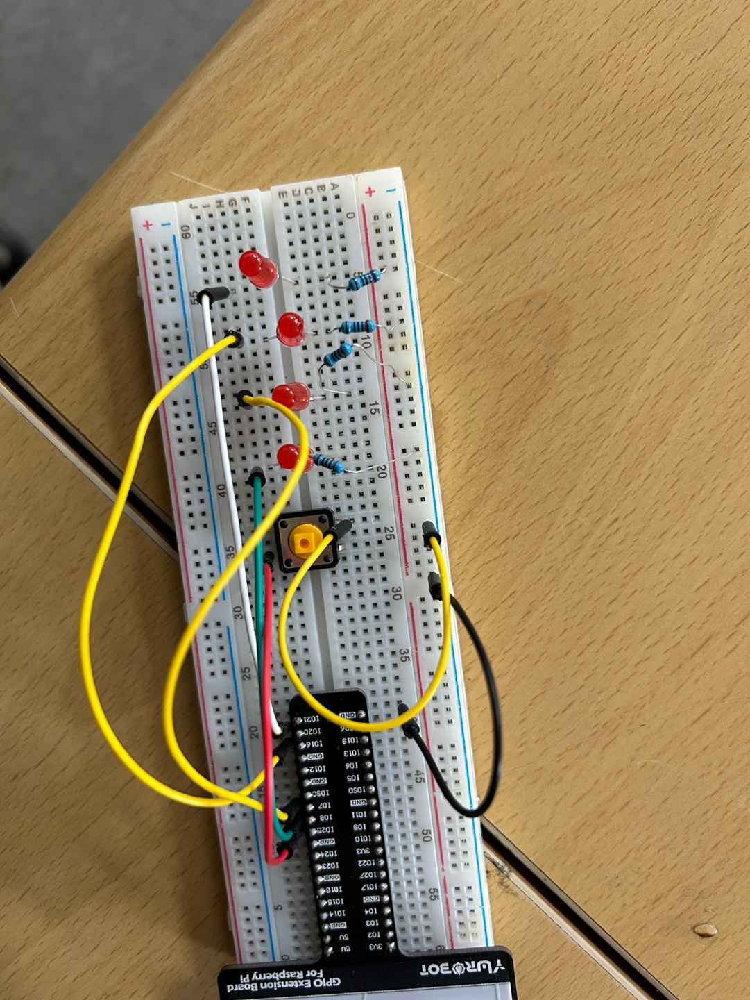

# 🟡 2. 버튼이 눌릴 때마다 LED 토글 시키기
https://youtu.be/huLmzw4uBc0?feature=shared

## ✅ 설명  
이 프로젝트는 버튼을 **한 번 누를 때마다** LED가 on/off로 **토글(toggle)** 되도록 만듭니다.  
즉, 버튼을 누를 때만 반응하고, 누르고 있는 동안에는 상태가 바뀌지 않도록 딜레이 처리가 되어 있습니다.

- 처음 누르면 켜짐 (`led.on()`)
- 한 번 더 누르면 꺼짐 (`led.off()`)

---

## 📷 회로도  


---

## 🔌 핀 연결

| 구성품 | BCM 핀 번호 | 설명        |
|--------|-------------|-------------|
| LED    | 8           | LED 출력 핀 |
| 버튼   | 25          | 입력 버튼 핀 (내부 PULLUP 사용) |

---

## 🧠 코드

```python
from gpiozero import LED, Button
from time import sleep

led = LED(8)
btn = Button(25)
state = 1

while True:
    if btn.is_pressed:
        if state == 0:
            state = 1
            led.on()
        else:
            state = 0
            led.off()

        while btn.is_pressed:
            sleep(0.1)  # 버튼을 계속 누르고 있는 동안 중복 입력 방지
