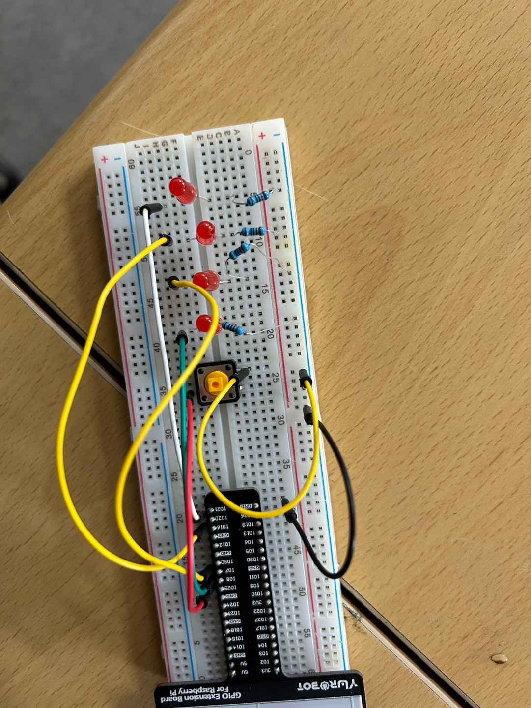

# 🔴 4. 버튼이 눌릴 때마다 4-bit 카운터 값 증가시키기
https://youtu.be/huLmzw4uBc0?feature=shared

## ✅ 설명  
이 프로젝트는 버튼이 눌릴 때마다 **4비트 카운터 값이 1씩 증가**하고,  
해당 값이 이진수로 LED에 표시됩니다.

- 버튼을 누를 때마다 count 값이 0~15까지 순차적으로 증가
- LED는 4비트 이진수로 현재 값을 표현 (0000 ~ 1111)
- 15(1111) 이후에는 0(0000)으로 순환

---

## 📷 회로도  


---

## 🔌 핀 연결

| 비트 위치 | 의미 | BCM 핀 번호 |
|-----------|------|-------------|
| LSB       | 2⁰   | 8           |
|           | 2¹   | 7           |
|           | 2²   | 16          |
| MSB       | 2³   | 20          |
| 버튼      | 입력 | 25          |

---

## 🧠 코드

```python
from gpiozero import LED, Button
from signal import pause

# 4비트용 LED 연결
led0 = LED(8)   # LSB (2^0)
led1 = LED(7)   # 2^1
led2 = LED(16)  # 2^2
led3 = LED(20)  # MSB (2^3)

btn = Button(25)

count = 0  # 0~15 사이의 숫자를 저장하는 카운터 변수

# 숫자를 이진수로 변환해 LED로 표시하는 함수
def show_binary(n):
    led0.value = n & 0b0001
    led1.value = (n >> 1) & 0b0001
    led2.value = (n >> 2) & 0b0001
    led3.value = (n >> 3) & 0b0001

# 버튼이 눌렸을 때 호출되는 함수
def on_button_pressed():
    global count
    count = (count + 1) % 16  # 0~15까지 증가 후 다시 0으로
    show_binary(count)
    print(f"count = {count}")

# 버튼 눌렀을 때 이벤트 연결
btn.when_pressed = on_button_pressed

pause()  # 프로그램을 계속 실행시켜주는 대기 함수
